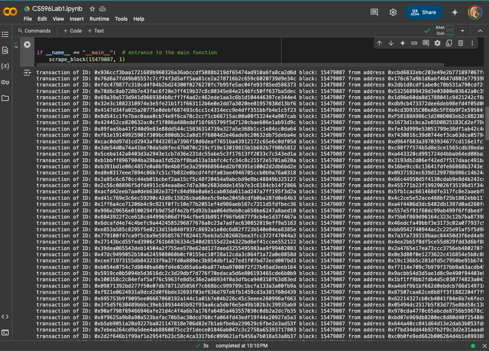
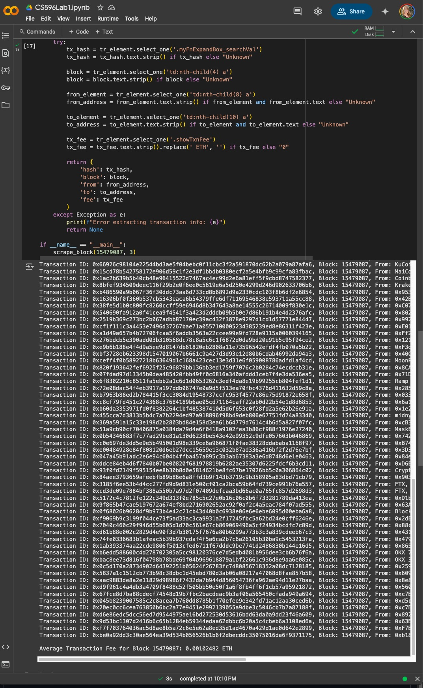
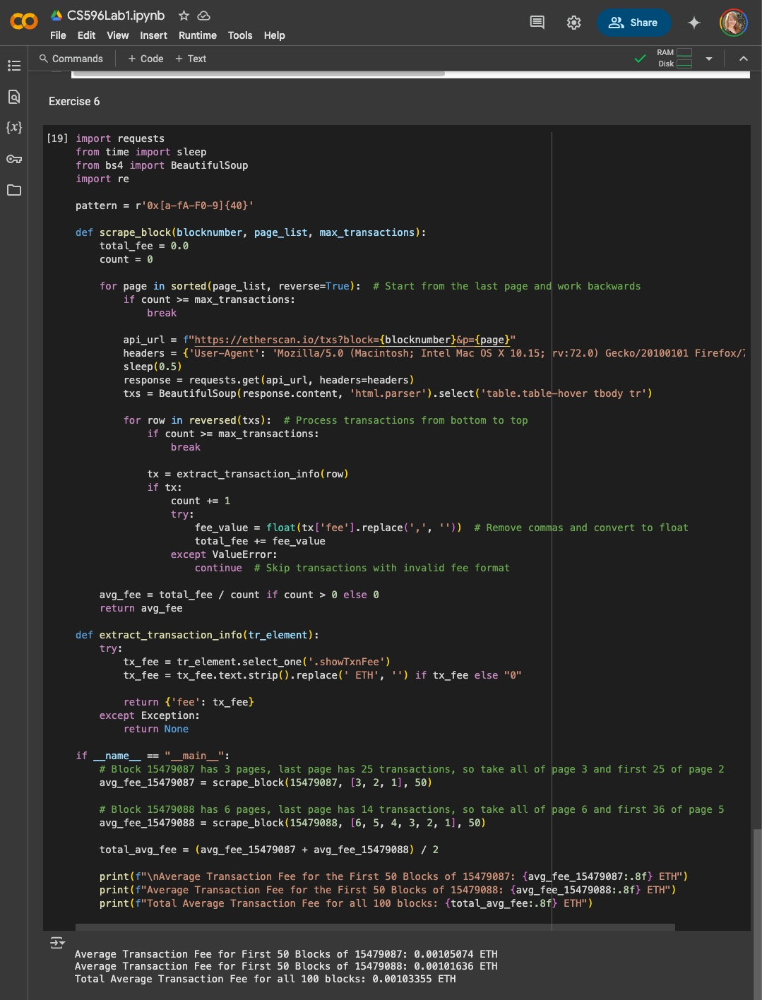
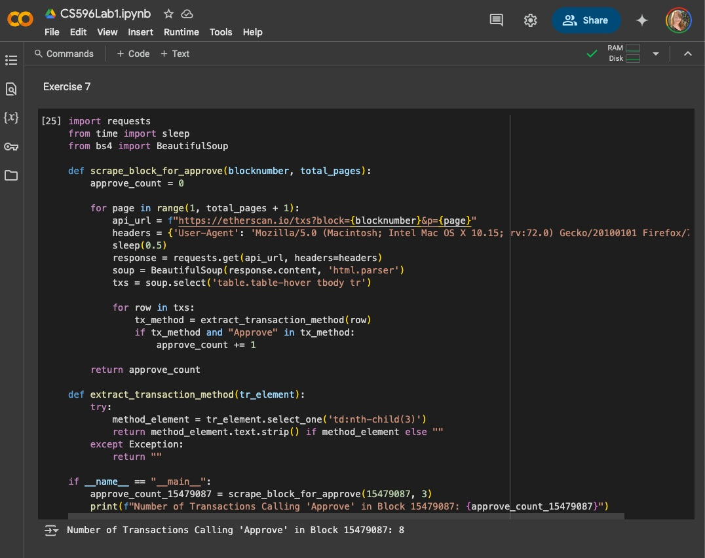

# CS596Lab1

### Exercise 1: 0.00172267427 

(0x84ae + 0x93f0 + 0x3185) / 3

0.003466336190625422 + 0.000693422767888305 + 0.00100826386933125 = 0.00516802282

0.00516802282/3 = **_0.00172267427_** Average of 0x84ae, predecessor and successor

### Exercise 2: 0xbac8ee73d816f04798b78bde69f04b969618879a1bf22661c936d8e9aa6e085c

Largest transaction in block 15479087 

Transaction Hash _**0xbac8ee73d816f04798b78bde69f04b969618879a1bf22661c936d8e9aa6e085c**_

With 149.999232 ETH transfer with 0.000651 fee

### Exercise 3: 0.00018964

15479087 last transaction:

0x936ccf3baa1721689b960326a36abccdf5088b219df65474ad910a6fa8ca2d6d

0.00019191

15479088 first transaction:

0xa98ea1a3cb9721cf05e26dc1e4cee7b7485912918fae29cc9deea08c991339fc

0.00018737
	
0.00019191 + 0.00018737 = 0.00037928

0.00037928/2 = _**0.00018964**_ average transaction fee

### Exercise 4 - Output:




### Exercise 5 - Modified Code:

```python
import requests
from time import sleep
from bs4 import BeautifulSoup
import re

pattern = r'0x[a-fA-F0-9]{40}'

def scrape_block(blocknumber, total_pages):
    total_fee = 0.0
    count = 0
    
    for page in range(1, total_pages + 1):
        api_url = f"https://etherscan.io/txs?block={blocknumber}&p={page}"
        headers = {'User-Agent': 'Mozilla/5.0 (Macintosh; Intel Mac OS X 10.15; rv:72.0) Gecko/20100101 Firefox/72.0'}
        sleep(0.5)
        response = requests.get(api_url, headers=headers)
        txs = BeautifulSoup(response.content, 'html.parser').select('table.table-hover tbody tr')
        
        for row in txs:
            tx = extract_transaction_info(row)
            if tx:
                count += 1
                try:
                    fee_value = float(tx['fee'].replace(',', ''))  # Remove commas and convert to float
                    total_fee += fee_value
                except ValueError:
                    print(f"Skipping transaction {tx['hash']} due to invalid fee format: {tx['fee']}")
                print(f"Transaction ID: {tx['hash']}, Block: {tx['block']}, From: {tx['from']}, To: {tx['to']}, Transaction Fee: {tx['fee']} ETH")
    
    if count > 0:
        avg_fee = total_fee / count
        print(f"\nAverage Transaction Fee for Block {blocknumber}: {avg_fee:.8f} ETH")
    else:
        print("No transactions found.")

def extract_transaction_info(tr_element):
    try:
        tx_hash = tr_element.select_one('.myFnExpandBox_searchVal')
        tx_hash = tx_hash.text.strip() if tx_hash else "Unknown"

        block = tr_element.select_one('td:nth-child(4) a')
        block = block.text.strip() if block else "Unknown"

        from_element = tr_element.select_one('td:nth-child(8) a')
        from_address = from_element.text.strip() if from_element and from_element.text else "Unknown"

        to_element = tr_element.select_one('td:nth-child(10) a')
        to_address = to_element.text.strip() if to_element and to_element.text else "Unknown"

        tx_fee = tr_element.select_one('.showTxnFee')
        tx_fee = tx_fee.text.strip().replace(' ETH', '') if tx_fee else "0"
        
        return {
            'hash': tx_hash,
            'block': block,
            'from': from_address,
            'to': to_address,
            'fee': tx_fee
        }
    except Exception as e:
        print(f"Error extracting transaction info: {e}")
        return None

if __name__ == "__main__":
    scrape_block(15479087, 3)
```
### Exercise 5 - Output:



### Exercise 6 - Modified Code

```python
import requests
from time import sleep
from bs4 import BeautifulSoup
import re

pattern = r'0x[a-fA-F0-9]{40}'

def scrape_block(blocknumber, page_list, max_transactions):
    total_fee = 0.0
    count = 0
    
    for page in sorted(page_list, reverse=True):  # Start from the last page and work backwards
        if count >= max_transactions:
            break
        
        api_url = f"https://etherscan.io/txs?block={blocknumber}&p={page}"
        headers = {'User-Agent': 'Mozilla/5.0 (Macintosh; Intel Mac OS X 10.15; rv:72.0) Gecko/20100101 Firefox/72.0'}
        sleep(0.5)
        response = requests.get(api_url, headers=headers)
        txs = BeautifulSoup(response.content, 'html.parser').select('table.table-hover tbody tr')
        
        for row in reversed(txs):  # Process transactions from bottom to top
            if count >= max_transactions:
                break
            
            tx = extract_transaction_info(row)
            if tx:
                count += 1
                try:
                    fee_value = float(tx['fee'].replace(',', ''))  # Remove commas and convert to float
                    total_fee += fee_value
                except ValueError:
                    continue  # Skip transactions with invalid fee format
    
    avg_fee = total_fee / count if count > 0 else 0
    return avg_fee

def extract_transaction_info(tr_element):
    try:
        tx_fee = tr_element.select_one('.showTxnFee')
        tx_fee = tx_fee.text.strip().replace(' ETH', '') if tx_fee else "0"
        
        return {'fee': tx_fee}
    except Exception:
        return None

if __name__ == "__main__":
    # Block 15479087 has 3 pages, last page has 25 transactions, so take all of page 3 and first 25 of page 2
    avg_fee_15479087 = scrape_block(15479087, [3, 2, 1], 50)
    
    # Block 15479088 has 6 pages, last page has 14 transactions, so take all of page 6 and first 36 of page 5
    avg_fee_15479088 = scrape_block(15479088, [6, 5, 4, 3, 2, 1], 50)
    
    total_avg_fee = (avg_fee_15479087 + avg_fee_15479088) / 2
    
    print(f"\nAverage Transaction Fee for First 50 Blocks of 15479087: {avg_fee_15479087:.8f} ETH")
    print(f"Average Transaction Fee for First 50 Blocks of 15479088: {avg_fee_15479088:.8f} ETH")
    print(f"Total Average Transaction Fee for all 100 blocks: {total_avg_fee:.8f} ETH")
```
### Exercise 6 - Output:



### Exercise 7 - Modified Code

```python
import requests
from time import sleep
from bs4 import BeautifulSoup

def scrape_block_for_approve(blocknumber, total_pages):
    approve_count = 0
    
    for page in range(1, total_pages + 1):
        api_url = f"https://etherscan.io/txs?block={blocknumber}&p={page}"
        headers = {'User-Agent': 'Mozilla/5.0 (Macintosh; Intel Mac OS X 10.15; rv:72.0) Gecko/20100101 Firefox/72.0'}
        sleep(0.5)
        response = requests.get(api_url, headers=headers)
        soup = BeautifulSoup(response.content, 'html.parser')
        txs = soup.select('table.table-hover tbody tr')
        
        for row in txs:
            tx_method = extract_transaction_method(row)
            if tx_method and "Approve" in tx_method:  
                approve_count += 1
    
    return approve_count

def extract_transaction_method(tr_element):
    try:
        method_element = tr_element.select_one('td:nth-child(3)') 
        return method_element.text.strip() if method_element else ""
    except Exception:
        return ""

if __name__ == "__main__":
    approve_count_15479087 = scrape_block_for_approve(15479087, 3)
    print(f"Number of Transactions Calling 'Approve' in Block 15479087: {approve_count_15479087}")
```

### Exercise 7 - Output:


